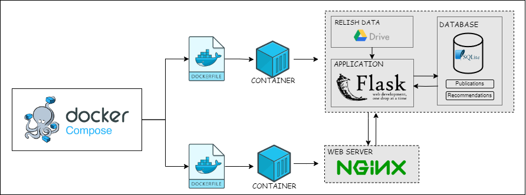
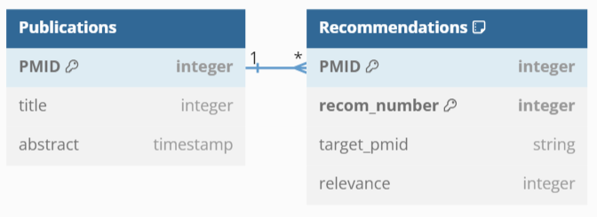

# Mock Recommendation System

This repository consists of code for a mock recommendation system designed for internal learning purposes to understand the STELLA architecture and its integration potential for recommendation systems in production and utilizes the RELISH corpus. 

## Developer Documentation

### Table of Contents

1. [Technical Architecture](#technical-architecture)
2. [Database Schema](#database-schema)
3. [Setting Up the Development Environment](#setting-up-the-development-environment)
    + [Installing Docker](#1-installing-docker)
    + [Cloning the Repository](#2-cloning-the-repository)
    + [Building and Running the Docker Container](#3-building-and-running-the-docker-container)
    + [Accessing the Application](#4-accessing-the-system)

## Technical Architecture
The Mock Recommendation System is a Flask-based web application running inside Docker containers, with a SQLite3 database backend. The application provides a simple recommendation interface, styled using CSS and HTML.

The Docker setup uses Docker Compose to manage two containers: one for the web application and one for Nginx. The web application container runs the actual Flask application, downloading the RELISH dataset from the specified drive and placing it in the appropriate directory. It then sets up, migrates, and populates the SQLite database before starting the Flask web application. The Nginx container handles the reverse proxy, routing incoming HTTP requests to the Flask application container. This setup ensures a consistent and isolated environment for development and deployment. The application workflow involves the web application container initializing by downloading the RELISH dataset, setting up and migrating the SQLite database, populating the database with initial data, and starting the Flask web server. The Nginx container acts as a reverse proxy, handling incoming requests and forwarding them to the Flask application.




## Database Schema

The SQLite3 database schema consists of two tables: Publications and Recommendations.

### Publications Table
+ PMID: Primary key, unique identifier for each publication (integer).
+ title: The title of the publication (string).
+ abstract: The abstract of the publication (string).

### Recommendations Table
+ PMID: Foreign key, references PMID in the Publications table, part of the composite primary key (integer).
+ recom_number: Primary key, unique identifier for each recommendation per + publication, part of the composite primary key (integer).
+ target_pmid: The PMID of the target publication that is being recommended (string).
+ relevance: A relevance score for the recommendation (integer).




## Setting Up the Development Environment

To set up the Mock Recommendation System on your local machine, follow these steps:

### 1. Installing Docker

+ Update your existing list of packages:
```
sudo apt update
```

+ Install a few prerequisite packages which let apt use packages over HTTPS:
```
sudo apt install apt-transport-https ca-certificates curl software-properties-common
```


+ Add the GPG key for the official Docker repository:
```
curl -fsSL https://download.docker.com/linux/ubuntu/gpg | sudo apt-key add -
```


+ Add the Docker repository to APT sources:
```
sudo add-apt-repository "deb [arch=amd64] https://download.docker.com/linux/ubuntu focal stable"
```


+ Update the package database with the Docker packages:
```
sudo apt update
```


+ Install Docker:
```
sudo apt install docker-ce
```


+ Verify the installation:
```
sudo docker run hello-world
```
### 2. Cloning the Repository

Clone the Mock Recommendation System repository from GitHub:

```
git clone https://github.com/zbmed-semtec/mock_recommendation_system.git
cd repository
```

### 3. Building and Running the Docker Container

To build and start the containers, run the following command:

```
sudo docker compose up -d
```

To check if the containers are working as required, you could run the following command:

```
sudo docker container ps -a
```


### 4. Accessing the System
Once the system is up and running, you can access it using your web browser at http://localhost:5000.