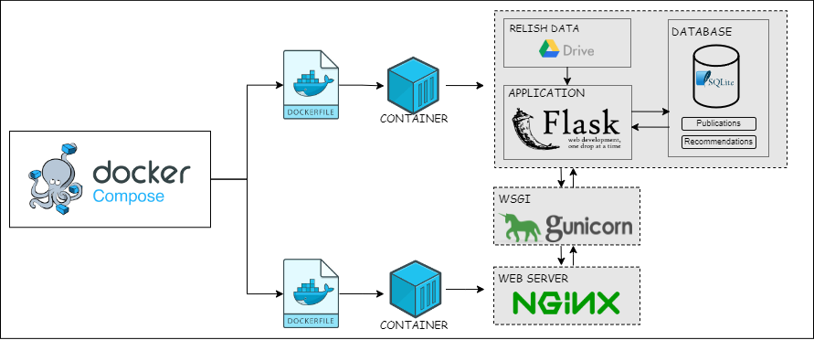

# Mock Recommendation System

This repository consists of code for a mock recommendation system designed for internal learning purposes to understand the STELLA architecture and its integration potential for recommendation systems in production and utilizes the RELISH corpus. 


### Table of Contents

1. [About the RELISH Corpus](#about-the-relish-corpus)
    + [Data Source and Characteristics](#data-source-and-characteristics)
    + [Relevance Assessment](#relevance-assessment)
    + [Input Data](#input-data)
1. [Technical Architecture](#technical-architecture)
2. [Database Schema](#database-schema)
3. [Developer Documentation](#developer-documentation)
    + [Installing Docker](#1-installing-docker)
    + [Cloning the Repository](#2-cloning-the-repository)
    + [Creating a virtual environment](#3-creating-a-virtual-environment)
    + [Building and Running the Docker Container](#3-building-and-running-the-docker-container)
    + [Accessing the Application](#4-accessing-the-system)
    + [Retrieving System Logs](#6-retrieving-system-logs)


## About the RELISH Corpus
The Mock Recommendation System leverages the RELISH corpus as its primary dataset. RELISH stands for "Resource for Evaluating Literature in Similarity Search and other Text-handling tasks". It is an expert-curated database specifically designed for benchmarking document similarity in biomedical literature.
 
The RELISH corpus comprises a expert curated collection of biomedical literature documents along with assessments of their similarity to other documents within the corpus. Each document is identified by its unique PubMed Identifier (PMID), a standardized identifier used for referencing biomedical literature.

### Data Source and Characteristics
The version 1 of the RELISH corpus was retrieved from its corresponding FigShare record on the 24th of January 2022. It is structured as a JSON file containing pairs of PMIDs along with their relevance assessments concerning other PMIDs in the corpus.

### Relevance Assessment
For each pair of PMIDs, the relevance is categorized into three main classes:

+ **Relevant (2)** : Indicates a strong relevance between the two documents.
+ **Partially relevant (1)** : Suggests a moderate level of relevance between the documents.
+ **Irrelevant (0)** : Denotes a lack of meaningful relevance between the documents.

### Input Data

Based on the RELISH JSON file, we created two input files:
+ **relish_text.jsonl** : Contains each article within the RELISH corpus with its corresponding title and abstract.
+ **relish_recoms.jsonl** : Contains pairwise assessments between each reference document and assessed document along with a relevance score. The article recommendations in our system follow the order in which the articles appear in the RELISH Database JSON file.

These files were created using the code in this [folder](./code). Please refer to the [documentation](./code/execution.md) in this folder for executing the script. For ease of use, the data is hosted on Google Drive and is retrieved using a bash script within the Docker container.


## Technical Architecture
The Mock Recommendation System is a Flask-based web application running inside Docker containers, with a SQLite3 database backend. The application provides a simple recommendation interface, styled using CSS and HTML.

The Docker setup uses Docker Compose to manage two containers: one for the web application and one for Nginx and Gunicorn. 
+ The web application container runs the actual Flask application, downloading the RELISH dataset from the specified drive and placing it in the appropriate directory. It then sets up, migrates, and populates the SQLite database before starting the Flask web application. 

+ The Nginx and Gunicorn container handles the reverse proxy and the application server. Nginx serves as the reverse proxy, routing incoming HTTP requests to the Gunicorn server running the Flask application.




## Database Schema

The SQLite3 database schema consists of two tables: Publications and Recommendations.

### Publications Table

The data from **'relish_text.jsonl'** is used to populate this table.

+ PMID: Primary key, unique identifier for each publication (integer).
+ title: The title of the publication (string).
+ abstract: The abstract of the publication (string).

### Recommendations Table

The data from **'relish_recoms.jsonl'** is used to populate this table. 

+ PMID: Foreign key, references PMID in the Publications table, part of the composite primary key (integer).
+ recom_number: Primary key, unique identifier for each recommendation per + publication, part of the composite primary key (integer).
+ target_pmid: The PMID of the target publication that is being recommended (string).
+ relevance: A relevance score for the recommendation (integer).


## Developer Documentation

To deploy the Mock Recommendation System on an Ubuntu server, follow these steps:

### 1. Installing Docker

+ Update your existing list of packages:
```
sudo apt update
```

+ Install a few prerequisite packages which let apt use packages over HTTPS:
```
sudo apt install apt-transport-https ca-certificates curl software-properties-common
```


+ Add the GPG key for the official Docker repository:
```
curl -fsSL https://download.docker.com/linux/ubuntu/gpg | sudo apt-key add -
```


+ Add the Docker repository to APT sources:
```
sudo add-apt-repository "deb [arch=amd64] https://download.docker.com/linux/ubuntu focal stable"
```


+ Update the package database with the Docker packages:
```
sudo apt update
```


+ Install Docker:
```
sudo apt install docker-ce
```


+ Verify the installation:
```
sudo docker run hello-world
```
### 2. Cloning the Repository

Clone the Mock Recommendation System repository from GitHub:

###### Using HTTP:

```
git clone https://github.com/zbmed-semtec/mock_recommendation_system.git
cd mock_recommendation_system
```

###### Using SSH:
Ensure you have set up SSH keys in your GitHub account.

```
git@github.com:zbmed-semtec/mock_recommendation_system.git
cd mock_recommendation_system
```

### 3. Creating a virtual environment

To create a virtual environment within your repository, run the following command:

```
python3 -m venv .venv 
source .venv/bin/activate
```

### 4. Building and Running the Docker Container

To build and start the containers, run the following command:

```
sudo docker compose up -d
```

To check if the containers are working as required, you could run the following command:

```
sudo docker container ps -a
```

### 5. Accessing the System
Once the system is up and running, you can access it using your web browser at the server's IP address.

Based on the server, please update the [`nginx.conf`](./nginx/nginx.conf) file to include the correct IP address:


```
server {

    listen 80;
    server_name <server's IP address>;
    client_max_body_size 200M;

    location / {
        proxy_pass http://web:5000;
        proxy_set_header Host $host;
        proxy_set_header X-Real-IP $remote_addr;
        proxy_set_header X-Forwarded-For $proxy_add_x_forwarded_for;
        proxy_set_header X-Forwarded-Proto $scheme;
    }
}

```

### 6. Retrieving System logs

Docker handles the log files using volumes, the log directory and file will be created on your host machine. The log file will be named **'system.log'**. To access the logs, navigate to the logs directory in your project folder on the host machine.